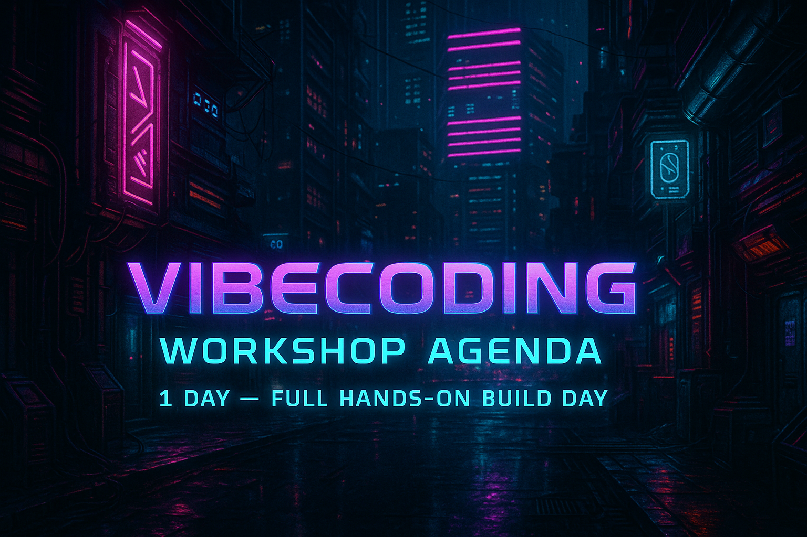

# VibeCode your AI MVP
integrate the latest azure ai features in a fun ui w/ Github Copilot &amp; Azure AI

    

# What is VibeCode-your-AI-MVP?
VibeCode-your-AI-MVP is a 1-day workshop designed to help users create Minimum Viable Products (MVPs) quickly and efficiently using the latest Azure AI features. The application leverages GitHub Copilot to provide an intuitive user interface that simplifies the process of building AI-powered applications. 

# Key Features
- **Azure AI Integration**: Utilize the latest Azure AI services to enhance your application with powerful AI capabilities.
- **GitHub Copilot**: Benefit from AI-assisted coding to speed up development and reduce boilerplate code.
- **User-Friendly UI**: A fun and engaging user interface that makes it easy to interact with AI features.
- **Rapid Prototyping**: Quickly create and iterate on your MVP within a single day.

# Goals 
- You sould integrate at least x of the latest Azure AI features:
    - Azure AI Agents
    - Azure AI Search
    - Semantic Kernel
    - Azure OpenAI
    - Azure AI Content Safety
    - Azure AI Document Intelligence
    - Azure AI Speech
    - Azure AI Vision
    - Azure AI Video

- You should use GitHub Copilot to assist in coding and development.
- You should create a user-friendly and engaging UI for the application.
- (OPTIONAL) You should be able to deploy the MVP on Azure or any other cloud platform.
- (OPTIONAL)You should document the development process and provide a guide for future enhancements.

# Success Criteria

- Showcase to your coach the technical spec and architecture of your MVP 
